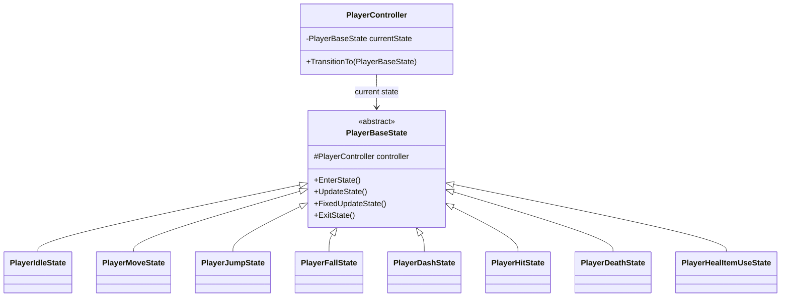
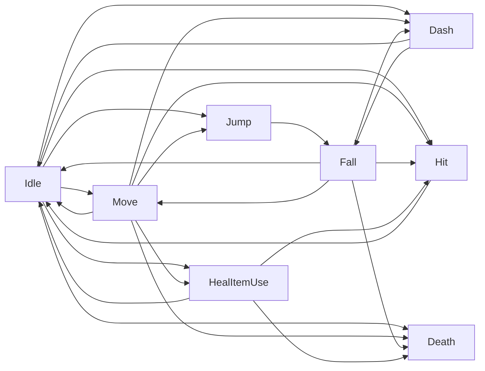
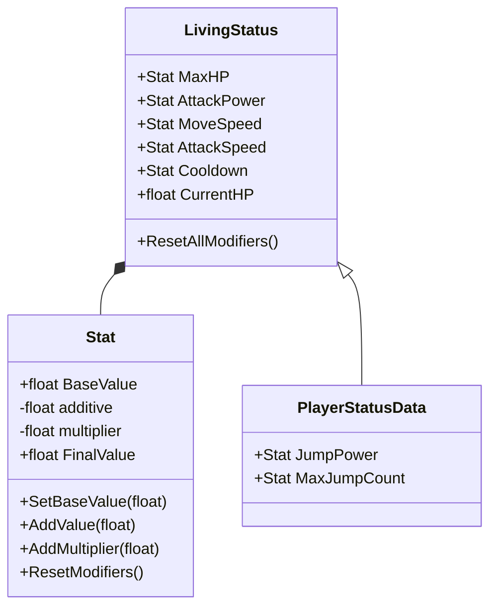
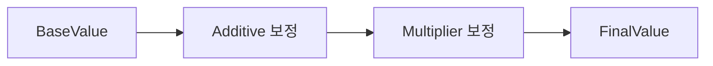
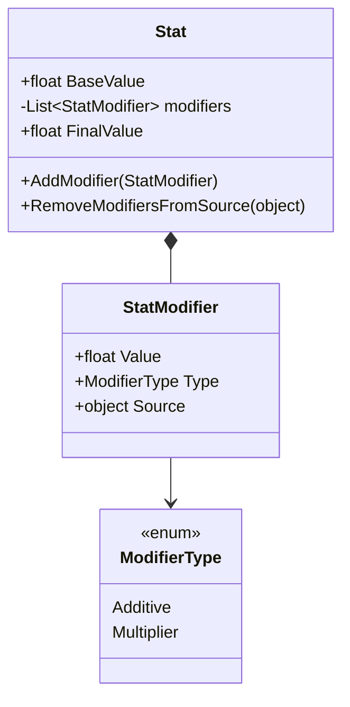

# Portfolio Discussion Notes - 2026-07-03

오늘 대화에서 정리한 포트폴리오 작성 방향입니다.

## 1. Player FSM 상태패턴

### 포트폴리오 방향

Player FSM은 모든 전환 조건을 자세히 보여주는 개발 문서보다, 포트폴리오에서는 다음 메시지가 드러나는 방향이 좋습니다.

> 플레이어 행동을 하나의 거대한 Update문이나 switch문으로 처리하지 않고, 상태별 클래스로 분리했다. 각 상태는 Enter / Update / Exit 생명주기를 가지며, PlayerController가 현재 상태를 교체하는 방식으로 동작한다.

### 추천 구성

1. 적용 배경
2. FSM을 선택한 이유
3. 상태패턴을 적용한 이유
4. 전체 구조
5. 상태별 책임
6. 핵심 상태 전환 흐름
7. 상태 권한 관리
8. 장점
9. 아쉬웠던 점
10. 개선 예정

### 클래스 다이어그램

포트폴리오에는 복잡한 전이 조건보다 아래 정도의 클래스 구조가 더 적합합니다.



### 핵심 상태 전환 흐름

전체 전환 조건을 모두 넣으면 너무 복잡해지므로, 포트폴리오에는 핵심 흐름만 보여주는 것이 좋습니다.



### 상태 분류

| 분류 | 상태 |
| --- | --- |
| 기본 이동 | Idle, Move |
| 공중 동작 | Jump, Fall |
| 특수 행동 | Dash, Hit, HealItemUse |
| 종료 상태 | Death |

### 전환 조건 검토 결과

대화 중 정리한 FSM 전환 조건은 대부분 현재 코드와 일치합니다. 다만 `Any -> Death`는 코드 기준으로 조금 더 정확히 표현해야 합니다.

현재 코드에서 `Dash`, `Hit`, `Death`는 `CanTakeDamage == false`이므로 데미지로 인한 HP 감소가 막힙니다. 따라서 `Any -> Death`보다 아래 표현이 더 정확합니다.

```text
Idle / Move / Jump / Fall / HealItemUse -> HP <= 0 -> Death
```

### 상태 권한 관리

`PlayerBaseState`에서 상태별 행동 가능 여부를 프로퍼티로 제공하고, 각 상태가 필요한 권한만 override하는 구조입니다.

```text
CanAttack
CanDash
CanParry
CanUseHealItem
CanTakeDamage
CanUpdateFacingDirection
```

예시:

| DashState |
| --- |
| 공격 X |
| 대쉬 X |
| 패링 X |
| 피격 X |
| 방향 변경 X |

| HealItemUseState |
| --- |
| 공격 X |
| 대쉬 X |
| 추가 회복 사용 X |
| 피격 O |
| 회복 처리 O |

이 권한 구조는 포트폴리오에서 강조하기 좋은 부분입니다. 단순히 상태를 나눈 것뿐 아니라, 상태마다 허용되는 행동을 일관된 방식으로 제어했다는 점이 드러납니다.

### 포트폴리오 문서 검토 메모

- `상태 전환표`라는 제목보다 `핵심 상태 전환 흐름` 또는 `상태 전환 흐름도`가 더 정확합니다.
- Mermaid 코드블록 종료 뒤 백틱이 하나 더 있으면 렌더링이 깨질 수 있으므로 제거해야 합니다.
- `개선 예정`에는 이미 한 일을 쓰기보다 앞으로 할 일을 쓰는 편이 좋습니다.
- `기존 PlayerController를 거의 수정하지 않고 새로운 State만 구현하면 됩니다`는 약간 과장될 수 있습니다. 실제로 상태 인스턴스 생성과 전환 연결은 필요할 수 있으므로 아래 표현이 더 안전합니다.

```text
새로운 기능을 추가할 때 기존 상태 클래스의 수정 범위를 줄이고, 새로운 State 클래스를 중심으로 기능을 확장할 수 있습니다.
```

## 2. 스탯 모디파이어 구조

### 현재 구현 기준

현재 프로젝트의 `Stat` 구조는 완성형 `StatModifier` 리스트 패턴이라기보다는, `BaseValue`, `additive`, `multiplier`를 이용한 단순 스탯 보정 구조입니다.

현재 계산식:

```text
FinalValue = (BaseValue + additive) * multiplier
```

예시:

```text
Base AttackPower = 10
Additive = +5
Multiplier = +20%

FinalValue = (10 + 5) * 1.2
FinalValue = 18
```

따라서 포트폴리오에서는 과장해서 `Stat Modifier Pattern 완성형`처럼 쓰기보다, 아래 방향이 더 좋습니다.

> 스탯 값을 직접 대입하지 않고, 기본값과 보정값을 분리하여 최종 스탯을 계산하는 구조로 설계했다.

### 추천 포트폴리오 구성

1. 적용 배경
2. 직접 스탯 변경 방식의 문제
3. 왜 Modifier 구조인가
4. 전체 구조
5. Base Stat
6. Additive Modifier
7. Multiplier Modifier
8. 계산 순서
9. 현재 적용 예시
10. 장점
11. 한계점
12. 개선 예정

### 적용 배경 예시

플레이어와 몬스터는 체력, 공격력, 이동속도, 공격속도, 쿨타임, 점프력 등 다양한 스탯을 가집니다. 처음에는 스탯 값을 직접 수정하는 방식도 가능했지만, 장비, 버프, 디버프, 성장 요소가 추가될 경우 어떤 값이 기본 능력치이고 어떤 값이 임시 보정인지 구분하기 어려워질 수 있다고 판단했습니다.

### 왜 Modifier 구조인가

스탯 값을 직접 바꾸면 버프 종료나 초기화 시 원래 값으로 되돌리는 과정이 복잡해집니다. 그래서 기본값과 보정값을 분리하고, 실제 게임 로직에서는 항상 계산된 최종값만 사용하도록 설계했습니다.

### 현재 구조 다이어그램



### 계산 순서



### 장점

- 기본 스탯과 보정 스탯을 분리할 수 있습니다.
- 공격력, 이동속도, 점프력 등 여러 스탯에 같은 계산 구조를 재사용할 수 있습니다.
- 사용하는 쪽에서는 `FinalValue`만 참조하면 되므로 코드가 단순해집니다.
- `ResetModifiers()`로 임시 보정값을 초기화하기 쉽습니다.

### 한계점

현재 구조의 한계점은 솔직하게 적는 것이 좋습니다. 포트폴리오에서 오히려 설계 의식이 드러납니다.

- 현재는 `additive`, `multiplier`를 단순 누적하므로 어떤 장비나 버프가 값을 추가했는지 추적하기 어렵습니다.
- 특정 Source의 Modifier만 제거하는 기능은 아직 없습니다.
- Modifier 적용 순서가 단순해서 복잡한 버프 우선순위나 곱연산 그룹을 표현하기 어렵습니다.

### 개선 예정

개선 예정에서는 `Source` 개념을 넣는 것이 좋습니다.

```text
현재는 보정값을 누적하는 단순 구조이지만, 이후에는 Modifier 객체를 별도로 만들고 Source를 함께 저장하여 장비 해제, 버프 종료, 디버프 제거를 더 명확하게 처리할 계획입니다.
```

예정 구조:



### 최종 방향

스탯 모디파이어 포트폴리오는 `현재 구현`과 `개선 예정`을 분리하는 방향이 가장 좋습니다.

현재 구현:

```text
BaseValue
additive
multiplier
FinalValue
ResetModifiers
```

개선 예정:

```text
StatModifier
Source
RemoveBySource
Modifier 우선순위
```

이렇게 쓰면 현재 구현을 과장하지 않으면서도, 왜 이런 구조를 선택했고 다음에는 어떻게 확장할 수 있는지까지 보여줄 수 있습니다.
